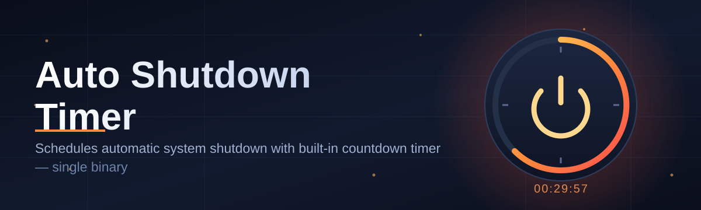
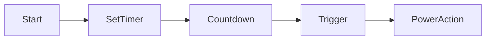

# Auto-Shutdown-Timer-6643 ⏻🕒

  

*Set it, forget it, walk away — your PC powers down exactly when you tell it to.*

  

## 🧭 What This Is NOT

This is not a bloated system utility suite that begs you to install five other tools you never asked for. It's not a subscription-based "optimizer" that nags you every ten minutes. It's not a background service that phones home with your data.

**What it actually is:** a lightweight, standalone auto shutdown timer for Windows that does exactly one job — turning your machine off, restarting it, or sending it to sleep after a countdown, a specific clock time, or a condition you define. No clutter, no accounts, no nonsense.

## 🌍 Overview

Every Windows user eventually hits the same wall: a download that needs to finish overnight, a render job that takes hours, a movie marathon that should end without you falling asleep with the laptop still burning power. The built-in `shutdown` command exists, sure, but typing timer syntax into a terminal every single time is nobody's idea of fun. That's the gap **Auto-Shutdown-Timer-6643** fills — a friendly graphical front door to Windows power management that anyone can use in seconds.

This tool was built for the everyday scenarios where manual shutdown just isn't practical: torrents finishing at 3 AM, batch encodes chewing through hours of footage, kids' screen-time limits, or simply saving electricity by making sure the PC doesn't idle all night. It's aimed at home users, gamers, IT admins managing shared machines, and anyone who's ever forgotten to turn their computer off.

Under the hood, it's a native Windows companion — no browser tab required, no cloud dependency, no telemetry collecting your habits. You set a duration or a target time, pick an action, and the app quietly counts down while you go do literally anything else. When the clock hits zero, it does what you told it to do. That's the whole philosophy: **predictable, transparent, and entirely yours to control.**

---

## 🔋 What It Actually Does

1. **Countdown shutdown** — punch in minutes or hours and the app handles the rest, ticking down in a clean visible timer.

2. **Exact time scheduling** — tell it "23:45" and your PC will shut down at that clock time, no math required.

3. **Multiple power actions** — choose shutdown, restart, sleep, hibernate, or simply lock the screen, all from one dropdown.

4. **Cancel anytime** — one click aborts the countdown instantly, no command-line wizardry needed.

5. **Process-aware waiting** — optionally wait for a specific application or download to close before starting the countdown.

6. **Silent tray mode** — minimize to the system tray so the timer runs invisibly while you keep working.

7. **Warning notifications** — get a heads-up toast a few minutes before shutdown so nothing gets lost mid-save.

8. **Persistent settings** — your last-used timer, action, and theme are remembered across launches.

9. **Zero footprint installation** — a single portable executable with nothing left scattered across your registry.

> [!TIP]
> Combine the countdown timer with the "wait for process" option when running large downloads — the app will hold off starting the clock until your torrent client or installer actually finishes.

---

## 🚀 How To Get Started

1. **Visit the landing page** using the download button above — that's the only place to grab the official build.

2. **Download the executable** — it's a single file, no bundled installer junk.

3. **Run it directly** — double-click, no admin rights typically required unless you enable hibernate scheduling.

4. **Set your timer and pick an action** — hit Start, and go about your day.

> [!NOTE]
> No dependencies to chase down. No .NET runtime prompts, no Visual C++ redistributable dance. It just runs.

---

## 🖥️ System Requirements

| Requirement | Details |
|---|---|
| OS | Windows 10 (64-bit) or Windows 11 |
| Architecture | x64 |
| Disk space | Under 15 MB |
| Dependencies | None — fully standalone |
| Internet | Not required after download |
| Admin rights | Only needed for hibernate/advanced power actions |

---

## ⚙️ How It Works

The internal flow is intentionally simple — that simplicity is the whole point of an auto shutdown timer.

1. You configure a duration, target time, or trigger condition.

2. The app starts an internal countdown loop and displays live status.

3. Optional checks run (process still open? condition still true?).

4. When the countdown reaches zero, the chosen Windows power action fires.

5. The system shuts down, restarts, sleeps, or locks — cleanly and on schedule.

> [!IMPORTANT]
> Always save open documents before your countdown ends. The warning notification exists for a reason — don't ignore it.

---

## 🧩 Troubleshooting

<strong>The timer says it finished but my PC didn't shut down — why?</strong>

Another open application may be blocking shutdown, or a pending Windows update is forcing a delay. Check for "please wait" dialogs behind other windows.

<strong>Can I cancel the countdown after it starts?</strong>

Yes — the Cancel button is always active during the countdown. There's also a keyboard shortcut for it, listed below.

<strong>Does this work with sleep and hibernate, or only full shutdown?</strong>

All four actions are supported: shutdown, restart, sleep, and hibernate. Hibernate must be enabled in your Windows power settings first.

<strong>Will it shut down my PC even if I'm actively using it?</strong>

Yes, by design — that's the point of a scheduled auto shutdown timer. Cancel it in advance if your plans change.

<strong>My antivirus flagged the executable — is that normal?</strong>

Power-management tools sometimes trigger heuristic false positives because they call shutdown APIs. Always verify you downloaded from the official landing page linked in this README.

> [!WARNING]
> Unsaved work is lost on shutdown or restart just like a normal Windows shutdown. This tool doesn't auto-save your documents for you.

---

## 🎨 UI & UX Details

**Keyboard shortcuts:**

- `Ctrl + S` — Start countdown
- `Ctrl + X` — Cancel countdown
- `Ctrl + T` — Toggle theme (light/dark)
- `Esc` — Minimize to tray

**Themes:** light, dark, and an auto mode that follows your Windows theme setting.

**Settings panel:** lets you adjust notification lead-time, default action, and whether the app launches minimized on startup.

> [!TIP]
> Dark mode plus tray minimization is the combo most night-owl users pick — the timer stays invisible until it needs your attention.

---

## 🤝 Contributing & Community

Got an idea for a new trigger type, a translation, or a UI tweak? Contributions are welcome.

- Open an issue describing the feature or bug clearly.
- Fork the repository and submit a pull request with a focused change.
- Keep discussions constructive — this project runs on volunteer time.

  

---

## 📜 License

Released under the [MIT License](LICENSE), 2026. Use it, modify it, share it — just keep the license notice intact.

---

## ⚠️ Disclaimer

This tool automates native Windows power functions (shutdown, restart, sleep, hibernate). It does not modify system files, does not require elevated privileges for standard use, and is provided as-is without warranty. Always ensure important work is saved before a scheduled shutdown completes.

